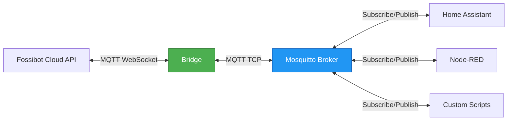

# Fossibot MQTT Bridge

*[English](README.md)*

Integration von Fossibot Powerstations in Smart Home Systeme (Home Assistant, Node-RED, ioBroker, etc.) via standardisiertem MQTT.

## Problem und Lösung

Fossibot Powerstations bieten zwar MQTT-Zugriff, jedoch:
- Nicht-standardisiertes Authentifizierungsverfahren über Cloud-API
- Unkommentierte und teils widersprüchliche API-Dokumentation
- Nur über offizielle App nutzbar

Diese Bridge löst das Problem durch:
- Asynchrones Andocken an die Fossibot Cloud-API
- Aufbereitung der Rohdaten in standardisierte JSON-Nachrichten
- Bereitstellung über lokalen MQTT-Broker (Standard: Mosquitto)
- Kompatibilität mit jedem MQTT-Server im lokalen Netzwerk

**Wichtig**: Fossibot erlaubt nur eine aktive Verbindung pro Account. Wenn die Bridge verbunden ist, wird die offizielle App abgemeldet und umgekehrt.

## Status und Einschränkungen

Dieses Projekt befindet sich in aktiver Entwicklung:

- **Getestet mit**: Fossibot F2400
- **Andere Modelle**: Wahrscheinlich kompatibel (F3000, F2000, etc.), aber nicht getestet
- **Multi-Account**: Konfiguration unterstützt mehrere Accounts, wurde aber nicht getestet
- **Stabilität**: Bridge läuft stabil im Dauerbetrieb, weitere Tests erwünscht

Rückmeldungen zu anderen Modellen oder Problemen gerne via GitHub Issues.

## Funktionsweise

Die Bridge hält eine permanente Verbindung zur Fossibot Cloud und arbeitet als Vermittler zum lokalen Netzwerk:



1. **Cloud-Verbindung**: Authentifiziert sich mit Fossibot-Zugangsdaten bei der Cloud-API
2. **Status-Polling**: Fragt Gerätestatus kontinuierlich ab (Standard: alle 30 Sekunden)
3. **MQTT-Publishing**: Publiziert aktuelle Daten auf lokalem MQTT-Broker
4. **Schnelle Steuerung**: Leitet Befehle vom MQTT-Broker an die Cloud weiter (typisch ~2 Sekunden Reaktionszeit)

Durch die permanente Verbindung sind Status-Updates zeitnah verfügbar und Steuerbefehle werden deutlich schneller übertragen als über die offizielle App.

## Installation

### Docker Compose (empfohlen)

1. Beispieldateien kopieren:
```bash
cp docker-compose.example.yml docker-compose.yml
cp config/config.docker.json config.json
```

2. `config.json` mit Zugangsdaten bearbeiten:
```bash
nano config.json
```

Erforderliche Einstellungen:
- `accounts[].email`: Fossibot Account E-Mail
- `accounts[].password`: Fossibot Passwort

3. Container starten:
```bash
docker compose up -d
```

4. Status prüfen:
```bash
docker compose logs -f fossibot-bridge
curl http://localhost:8082/health
```

### Docker Run (alternativ)

```bash
# Konfiguration erstellen
cp config/config.docker.json config.json
nano config.json  # Zugangsdaten eintragen

# Mosquitto MQTT Broker
docker run -d \
  --name fossibot-mosquitto \
  -p 1883:1883 \
  -v $(pwd)/docker/mosquitto/config/mosquitto.conf:/mosquitto/config/mosquitto.conf:ro \
  eclipse-mosquitto:2

# Fossibot Bridge
docker run -d \
  --name fossibot-bridge \
  -p 8082:8080 \
  -v $(pwd)/config.json:/etc/fossibot/config.json:ro \
  --link fossibot-mosquitto:mosquitto \
  timkaufmann/fossibot-bridge:latest
```

## Konfiguration

Die `config.json` steuert das Verhalten der Bridge:

### Accounts
```json
{
  "accounts": [
    {
      "email": "user@example.com",
      "password": "password",
      "enabled": true
    }
  ]
}
```

Mehrere Accounts werden unterstützt. Nur Accounts mit `"enabled": true` werden verbunden.

### MQTT Broker
```json
{
  "mosquitto": {
    "host": "mosquitto",
    "port": 1883,
    "username": null,
    "password": null,
    "client_id": "fossibot_bridge"
  }
}
```

- **host**: Hostname oder IP des MQTT-Brokers
- **port**: MQTT-Port (Standard: 1883)
- **username/password**: Zugangsdaten falls Broker Authentication nutzt
- **client_id**: Eindeutige Client-ID für MQTT-Verbindung

### Daemon
```json
{
  "daemon": {
    "log_file": "/var/log/fossibot/bridge.log",
    "log_level": "info",
    "pid_file": "/var/lib/fossibot/bridge.pid"
  }
}
```

- **log_level**: `debug`, `info`, `warning`, `error`
- Docker: Pfade nutzen `/var/log/fossibot` und `/var/lib/fossibot`
- Native: Relative Pfade wie `logs/bridge.log` sind möglich

### Bridge Verhalten
```json
{
  "bridge": {
    "status_publish_interval": 60,
    "device_poll_interval": 30,
    "reconnect_delay_min": 5,
    "reconnect_delay_max": 60
  }
}
```

- **status_publish_interval**: Sekunden zwischen Bridge-Status-Updates
- **device_poll_interval**: Sekunden zwischen Geräte-Status-Abfragen
- **reconnect_delay_min/max**: Wartezeit bei Verbindungsabbruch

## MQTT Topics

### Gerätestatus empfangen

Die Bridge publiziert den Status jedes Geräts auf:
```
fossibot/{MAC-Adresse}/state
```

Beispiel für Topic `fossibot/7C2C67AB5F0E/state`:
```json
{
  "mac": "7C2C67AB5F0E",
  "model": "F2400",
  "soc": 94.5,
  "inputWatts": 0,
  "outputWatts": 45,
  "dcInputWatts": 0,
  "usbOutput": true,
  "acOutput": false,
  "dcOutput": true,
  "ledOutput": false,
  "maxChargingCurrent": 15,
  "dischargeLowerLimit": 10.0,
  "acChargingUpperLimit": 95.0,
  "acSilentCharging": false,
  "usbStandbyTime": 0,
  "acStandbyTime": 0,
  "dcStandbyTime": 0,
  "screenRestTime": 0,
  "acChargingTimer": 0,
  "sleepTime": 5,
  "timestamp": "2025-10-05T14:23:40+00:00"
}
```

Die Nachrichten werden mit QoS 1 und Retained-Flag publiziert, sodass neue Subscriber sofort den letzten Status erhalten.

**Wichtige Felder:**
- `soc`: Akkustand in Prozent
- `inputWatts`: Eingangsleistung (z.B. Solar, AC-Ladung)
- `outputWatts`: Ausgangsleistung (alle Ausgänge zusammen)
- `usbOutput`, `acOutput`, `dcOutput`, `ledOutput`: Status der Ausgänge (true/false)
- `maxChargingCurrent`: Maximaler Ladestrom in Ampere (1-20A)
- `dischargeLowerLimit`: Untere Entladegrenze in Prozent (0-100%)
- `acChargingUpperLimit`: Obere Ladegrenze bei AC-Ladung in Prozent (0-100%)
- `acSilentCharging`: AC-Leise-Lademodus aktiv (true/false)
- `usbStandbyTime`: USB-Abschaltzeit in Minuten (0=deaktiviert, 3, 5, 10, 30)
- `acStandbyTime`: AC-Abschaltzeit in Minuten (0=deaktiviert, 480, 960, 1440)
- `dcStandbyTime`: DC-Abschaltzeit in Minuten (0=deaktiviert, 480, 960, 1440)
- `screenRestTime`: Display-Timeout in Sekunden (0=immer an, 180, 300, 600, 1800)
- `acChargingTimer`: AC-Lade-Timer in Minuten (0=deaktiviert, 1-1439)
- `sleepTime`: Standby-Timeout in Minuten (5, 10, 30, 480) - **niemals 0!**

### Geräte steuern

Befehle werden an das Command-Topic gesendet:
```
fossibot/{MAC-Adresse}/command
```

**Ausgänge schalten:**
```bash
# USB einschalten
mosquitto_pub -h localhost -t fossibot/7C2C67AB5F0E/command -m '{"action":"usb_on"}'

# USB ausschalten
mosquitto_pub -h localhost -t fossibot/7C2C67AB5F0E/command -m '{"action":"usb_off"}'

# AC einschalten
mosquitto_pub -h localhost -t fossibot/7C2C67AB5F0E/command -m '{"action":"ac_on"}'

# AC ausschalten
mosquitto_pub -h localhost -t fossibot/7C2C67AB5F0E/command -m '{"action":"ac_off"}'

# DC einschalten
mosquitto_pub -h localhost -t fossibot/7C2C67AB5F0E/command -m '{"action":"dc_on"}'

# DC ausschalten
mosquitto_pub -h localhost -t fossibot/7C2C67AB5F0E/command -m '{"action":"dc_off"}'

# LED einschalten
mosquitto_pub -h localhost -t fossibot/7C2C67AB5F0E/command -m '{"action":"led_on"}'

# LED ausschalten
mosquitto_pub -h localhost -t fossibot/7C2C67AB5F0E/command -m '{"action":"led_off"}'
```

**Einstellungen ändern:**
```bash
# Maximalen Ladestrom setzen (1-20 Ampere)
mosquitto_pub -h localhost -t fossibot/7C2C67AB5F0E/command -m '{"action":"set_charging_current","amperes":15}'

# Untere Entladegrenze setzen (0-100%)
mosquitto_pub -h localhost -t fossibot/7C2C67AB5F0E/command -m '{"action":"set_discharge_limit","percentage":10.0}'

# Obere AC-Ladegrenze setzen (0-100%)
mosquitto_pub -h localhost -t fossibot/7C2C67AB5F0E/command -m '{"action":"set_ac_charging_limit","percentage":95.0}'

# AC-Leise-Lademodus aktivieren/deaktivieren
mosquitto_pub -h localhost -t fossibot/7C2C67AB5F0E/command -m '{"action":"set_ac_silent_charging","enabled":true}'

# USB-Abschaltzeit setzen (0, 3, 5, 10 oder 30 Minuten)
mosquitto_pub -h localhost -t fossibot/7C2C67AB5F0E/command -m '{"action":"set_usb_standby_time","minutes":10}'

# AC-Abschaltzeit setzen (0, 480, 960 oder 1440 Minuten)
mosquitto_pub -h localhost -t fossibot/7C2C67AB5F0E/command -m '{"action":"set_ac_standby_time","minutes":480}'

# DC-Abschaltzeit setzen (0, 480, 960 oder 1440 Minuten)
mosquitto_pub -h localhost -t fossibot/7C2C67AB5F0E/command -m '{"action":"set_dc_standby_time","minutes":480}'

# Display-Timeout setzen (0, 180, 300, 600 oder 1800 Sekunden)
mosquitto_pub -h localhost -t fossibot/7C2C67AB5F0E/command -m '{"action":"set_screen_rest_time","seconds":300}'

# AC-Lade-Timer setzen (0-1439 Minuten, 0=deaktiviert)
mosquitto_pub -h localhost -t fossibot/7C2C67AB5F0E/command -m '{"action":"set_ac_charging_timer","minutes":244}'  # 4h 4min
mosquitto_pub -h localhost -t fossibot/7C2C67AB5F0E/command -m '{"action":"set_ac_charging_timer","minutes":0}'    # Timer deaktivieren

# Standby-Timeout setzen (5, 10, 30 oder 480 Minuten - NIEMALS 0!)
mosquitto_pub -h localhost -t fossibot/7C2C67AB5F0E/command -m '{"action":"set_sleep_time","minutes":10}'
```

**⚠️ Warnung**: Niemals `sleepTime` auf 0 setzen - das kann das Gerät unbrauchbar machen! Die Bridge validiert dies automatisch.

### Bridge Status

Die Bridge publiziert ihren eigenen Status auf:
```
fossibot/bridge/status
```

Beispiel:
```json
{
  "status": "online",
  "version": "2.0.0",
  "uptime": 3600,
  "accounts": {
    "total": 1,
    "connected": 1,
    "disconnected": 0
  },
  "devices": {
    "total": 2,
    "online": 2,
    "offline": 0
  },
  "mqtt": {
    "cloud_clients": 1,
    "local_broker": "connected"
  },
  "memory": {
    "usage_mb": 12,
    "limit_mb": 128
  }
}
```

## Fehlerbehebung

### Container startet nicht
```bash
docker compose logs fossibot-bridge
```

Häufige Ursachen:
- Falsche Zugangsdaten in `config.json`
- Mosquitto-Broker nicht erreichbar
- Ports bereits belegt

### Keine MQTT-Nachrichten
```bash
# MQTT-Verbindung testen
mosquitto_sub -h localhost -t 'fossibot/#' -v

# Bridge Status prüfen
curl http://localhost:8082/health
```

### Befehle funktionieren nicht
- MAC-Adresse im Topic korrekt?
- JSON-Payload valide? (Online JSON Validator nutzen)
- Gerät online? (Status-Topic prüfen)

Weitere Informationen: [docs/TROUBLESHOOTING.md](docs/TROUBLESHOOTING.md)

## Dokumentation

- [docs/INSTALL.md](docs/INSTALL.md) - Native Installation & systemd Setup
- [docs/OPERATIONS.md](docs/OPERATIONS.md) - Betrieb & Wartung
- [docs/TROUBLESHOOTING.md](docs/TROUBLESHOOTING.md) - Problemlösung
- [docs/UPGRADE.md](docs/UPGRADE.md) - Update-Anleitung
- [docs/deployment/](docs/deployment/) - Docker Deployment Details

## Lizenz

MIT
