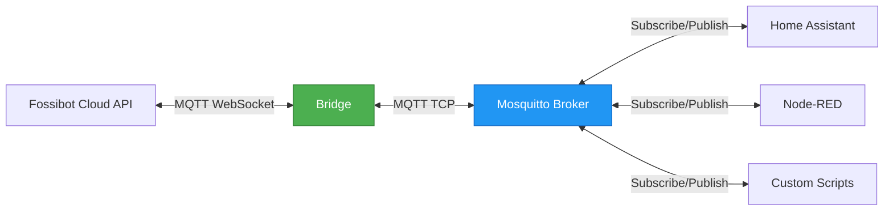

# Fossibot MQTT Bridge

*[Deutsch](README.de.md)*

Integrate Fossibot power stations into smart home systems (Home Assistant, Node-RED, ioBroker, etc.) via standardized MQTT.

## Problem and Solution

Fossibot power stations do offer MQTT access, but:
- Non-standard authentication via Cloud API
- Undocumented and sometimes contradictory API
- Only accessible through the official app

This bridge solves the problem by:
- Asynchronous connection to the Fossibot Cloud API
- Processing raw data into standardized JSON messages
- Publishing via local MQTT broker (default: Mosquitto)
- Compatible with any MQTT server on the local network

**Important**: Fossibot allows only one active connection per account. When the bridge is connected, the official app will be logged out and vice versa.

## Status and Limitations

This project is under active development:

- **Tested with**: Fossibot F2400
- **Other models**: Probably compatible (F3000, F2000, etc.), but untested
- **Multi-account**: Configuration supports multiple accounts, but untested
- **Stability**: Bridge runs stable in continuous operation, further testing welcome

Feedback on other models or issues welcome via GitHub Issues.

## How It Works

The bridge maintains a persistent connection to the Fossibot Cloud and acts as an intermediary to the local network:



1. **Cloud Connection**: Authenticates with Fossibot credentials to the Cloud API
2. **Status Polling**: Continuously queries device status (default: every 30 seconds)
3. **MQTT Publishing**: Publishes current data to local MQTT broker
4. **Fast Control**: Forwards commands from MQTT broker to the Cloud (typical response time ~2 seconds)

The persistent connection ensures timely status updates and commands are transmitted significantly faster than via the official app.

## Installation

### Docker Compose (recommended)

1. Copy example files:
```bash
cp docker-compose.example.yml docker-compose.yml
cp config/config.docker.json config.json
```

2. Edit `config.json` with credentials:
```bash
nano config.json
```

Required settings:
- `accounts[].email`: Fossibot account email
- `accounts[].password`: Fossibot password

3. Start containers:
```bash
docker compose up -d
```

4. Check status:
```bash
docker compose logs -f fossibot-bridge
curl http://localhost:8082/health
```

### Docker Run

Without Docker Compose, you can start the containers manually:

```bash
# Create config
cp config/config.docker.json config.json
nano config.json  # Add your credentials

# Mosquitto MQTT Broker
docker run -d \
  --name fossibot-mosquitto \
  -p 1883:1883 \
  -v $(pwd)/docker/mosquitto/config/mosquitto.conf:/mosquitto/config/mosquitto.conf:ro \
  eclipse-mosquitto:2

# Fossibot Bridge
docker run -d \
  --name fossibot-bridge \
  -p 8082:8080 \
  -v $(pwd)/config.json:/etc/fossibot/config.json:ro \
  --link fossibot-mosquitto:mosquitto \
  timkaufmann/fossibot-bridge:latest
```

## Configuration

The `config.json` controls the bridge behavior:

### Accounts
```json
{
  "accounts": [
    {
      "email": "your@email.com",
      "password": "YourPassword",
      "enabled": true
    }
  ]
}
```

Multiple accounts are supported. Only accounts with `"enabled": true` will be connected.

### MQTT Broker
```json
{
  "mosquitto": {
    "host": "mosquitto",
    "port": 1883,
    "username": null,
    "password": null,
    "client_id": "fossibot_bridge"
  }
}
```

- **host**: Hostname or IP of the MQTT broker
- **port**: MQTT port (default: 1883)
- **username/password**: Credentials if broker uses authentication
- **client_id**: Unique client ID for MQTT connection

### Daemon
```json
{
  "daemon": {
    "log_file": "/var/log/fossibot/bridge.log",
    "log_level": "info",
    "pid_file": "/var/lib/fossibot/bridge.pid"
  }
}
```

- **log_level**: `debug`, `info`, `warning`, `error`
- Docker: Use paths `/var/log/fossibot` and `/var/lib/fossibot`
- Native: Relative paths like `logs/bridge.log` are possible

### Bridge Behavior
```json
{
  "bridge": {
    "status_publish_interval": 60,
    "device_poll_interval": 30,
    "reconnect_delay_min": 5,
    "reconnect_delay_max": 60
  }
}
```

- **status_publish_interval**: Seconds between bridge status updates
- **device_poll_interval**: Seconds between device status queries
- **reconnect_delay_min/max**: Wait time on connection failure

## MQTT Topics

### Receiving Device Status

The bridge publishes the status of each device to:
```
fossibot/{MAC-Address}/state
```

Example for topic `fossibot/7C2C67AB5F0E/state`:
```json
{
  "mac": "7C2C67AB5F0E",
  "model": "F2400",
  "soc": 94.5,
  "inputWatts": 0,
  "outputWatts": 45,
  "dcInputWatts": 0,
  "usbOutput": true,
  "acOutput": false,
  "dcOutput": true,
  "ledOutput": false,
  "maxChargingCurrent": 15,
  "dischargeLowerLimit": 10.0,
  "acChargingUpperLimit": 95.0,
  "acSilentCharging": false,
  "usbStandbyTime": 0,
  "acStandbyTime": 0,
  "dcStandbyTime": 0,
  "screenRestTime": 0,
  "sleepTime": 5,
  "timestamp": "2025-10-05T14:23:40+00:00"
}
```

Messages are published with QoS 1 and the retained flag, so new subscribers immediately receive the last status.

**Important fields:**
- `soc`: Battery level in percent
- `inputWatts`: Input power (e.g., solar, AC charging)
- `outputWatts`: Output power (all outputs combined)
- `usbOutput`, `acOutput`, `dcOutput`, `ledOutput`: Output status (true/false)
- `maxChargingCurrent`: Maximum charging current in amperes (1-20A)
- `dischargeLowerLimit`: Lower discharge limit in percent (0-100%)
- `acChargingUpperLimit`: Upper charging limit for AC charging in percent (0-100%)
- `acSilentCharging`: AC silent charging mode enabled (true/false)
- `usbStandbyTime`: USB auto-off timeout in minutes (0=disabled, 3, 5, 10, 30)
- `acStandbyTime`: AC auto-off timeout in minutes (0=disabled, 480, 960, 1440)
- `dcStandbyTime`: DC auto-off timeout in minutes (0=disabled, 480, 960, 1440)
- `screenRestTime`: Screen timeout in seconds (0=always on, 180, 300, 600, 1800)
- `sleepTime`: Sleep timeout in minutes (5, 10, 30, 480) - **never 0!**

### Controlling Devices

Commands are sent to the command topic:
```
fossibot/{MAC-Address}/command
```

**Switching outputs:**
```bash
# Turn USB on
mosquitto_pub -h localhost -t fossibot/7C2C67AB5F0E/command -m '{"action":"usb_on"}'

# Turn USB off
mosquitto_pub -h localhost -t fossibot/7C2C67AB5F0E/command -m '{"action":"usb_off"}'

# Turn AC on
mosquitto_pub -h localhost -t fossibot/7C2C67AB5F0E/command -m '{"action":"ac_on"}'

# Turn AC off
mosquitto_pub -h localhost -t fossibot/7C2C67AB5F0E/command -m '{"action":"ac_off"}'

# Turn DC on
mosquitto_pub -h localhost -t fossibot/7C2C67AB5F0E/command -m '{"action":"dc_on"}'

# Turn DC off
mosquitto_pub -h localhost -t fossibot/7C2C67AB5F0E/command -m '{"action":"dc_off"}'

# Turn LED on
mosquitto_pub -h localhost -t fossibot/7C2C67AB5F0E/command -m '{"action":"led_on"}'

# Turn LED off
mosquitto_pub -h localhost -t fossibot/7C2C67AB5F0E/command -m '{"action":"led_off"}'
```

**Changing settings:**
```bash
# Set maximum charging current (1-20 amperes)
mosquitto_pub -h localhost -t fossibot/7C2C67AB5F0E/command -m '{"action":"set_charging_current","amperes":15}'

# Set lower discharge limit (0-100%)
mosquitto_pub -h localhost -t fossibot/7C2C67AB5F0E/command -m '{"action":"set_discharge_limit","percentage":10.0}'

# Set upper AC charging limit (0-100%)
mosquitto_pub -h localhost -t fossibot/7C2C67AB5F0E/command -m '{"action":"set_ac_charging_limit","percentage":95.0}'

# Enable/disable AC silent charging
mosquitto_pub -h localhost -t fossibot/7C2C67AB5F0E/command -m '{"action":"set_ac_silent_charging","enabled":true}'

# Set USB auto-off timeout (0, 3, 5, 10, or 30 minutes)
mosquitto_pub -h localhost -t fossibot/7C2C67AB5F0E/command -m '{"action":"set_usb_standby_time","minutes":10}'

# Set AC auto-off timeout (0, 480, 960, or 1440 minutes)
mosquitto_pub -h localhost -t fossibot/7C2C67AB5F0E/command -m '{"action":"set_ac_standby_time","minutes":480}'

# Set DC auto-off timeout (0, 480, 960, or 1440 minutes)
mosquitto_pub -h localhost -t fossibot/7C2C67AB5F0E/command -m '{"action":"set_dc_standby_time","minutes":480}'

# Set screen timeout (0, 180, 300, 600, or 1800 seconds)
mosquitto_pub -h localhost -t fossibot/7C2C67AB5F0E/command -m '{"action":"set_screen_rest_time","seconds":300}'

# Set sleep timeout (5, 10, 30, or 480 minutes - NEVER 0!)
mosquitto_pub -h localhost -t fossibot/7C2C67AB5F0E/command -m '{"action":"set_sleep_time","minutes":10}'
```

**⚠️ Warning**: Never set `sleepTime` to 0 - this will brick your device! The bridge validates this automatically.

### Bridge Status

The bridge publishes its own status to:
```
fossibot/bridge/status
```

Example:
```json
{
  "status": "online",
  "version": "2.0.0",
  "uptime": 3600,
  "accounts": {
    "total": 1,
    "connected": 1,
    "disconnected": 0
  },
  "devices": {
    "total": 2,
    "online": 2,
    "offline": 0
  },
  "mqtt": {
    "cloud_clients": 1,
    "local_broker": "connected"
  },
  "memory": {
    "usage_mb": 12,
    "limit_mb": 128
  }
}
```

## Troubleshooting

### Container won't start
```bash
docker compose logs fossibot-bridge
```

Common causes:
- Incorrect credentials in `config.json`
- Mosquitto broker unreachable
- Ports already in use

### No MQTT messages
```bash
# Test MQTT connection
mosquitto_sub -h localhost -t 'fossibot/#' -v

# Check bridge status
curl http://localhost:8082/health
```

### Commands don't work
- Is the MAC address in the topic correct?
- Is the JSON payload valid? (Use an online JSON validator)
- Is the device online? (Check status topic)

More information: [docs/TROUBLESHOOTING.md](docs/TROUBLESHOOTING.md)

## Documentation

- [docs/INSTALL.md](docs/INSTALL.md) - Native installation & systemd setup
- [docs/OPERATIONS.md](docs/OPERATIONS.md) - Operations & maintenance
- [docs/TROUBLESHOOTING.md](docs/TROUBLESHOOTING.md) - Troubleshooting
- [docs/UPGRADE.md](docs/UPGRADE.md) - Upgrade guide
- [docs/deployment/](docs/deployment/) - Docker deployment details

## License

MIT
